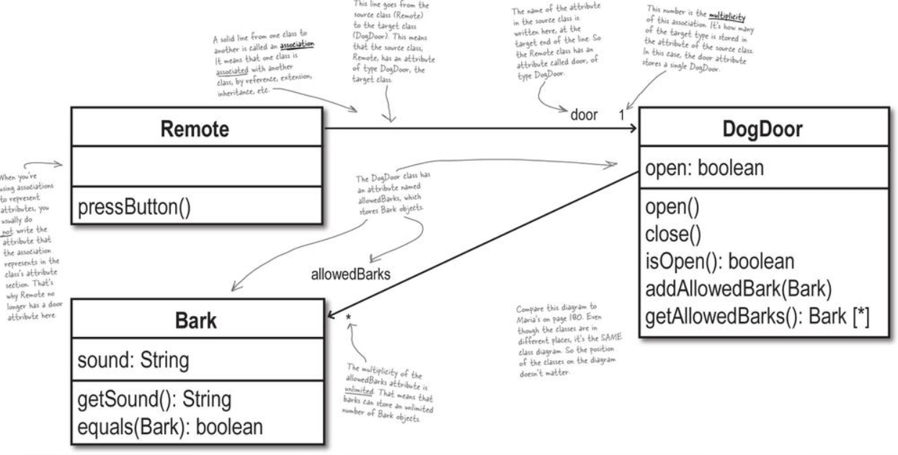

# 2.4.3 Doug's Dog Doors

## Introduction

Doug makes remote controlled dog doors. Using the remote, the customer can open/close the dog doors.

## Problem with the previous solution

1. A dog can have multiple barks for different moods.
2. So rather than having just one `Bark` stored in `DogDoor`, can have a list of barks.

## Identifying the problem

When focusing on the __Owner's Dog's bark__ in the usecase, the issue of not realizing that a dog can have multiple barks is clear.

> If the __Owner's Dog's Bark__ matches the bark heard by the `BarkRecognizer`, the dog door should open. 

When we focus on __Owner's Dog__ this thing becomes clearer.

> When the `BarkRecognizer` detects the __Owner's Dog__ Barking, it will request the door to open.

## Why not create a class `Dog`?

1. Storing a collection of `Bark` is essentially representing a dog which can have multiple barks.
2. We don't interact with the dog which is external in the system. The dog interacts with us.
3. We only create classes for roles (like Users, managers or some state holding entity that affects the system (Owner is asleep or awake)) and not living things generally.

## Defining class diagrams

If an object has an association (door is associated to BarkRecognizer), it is represented via a solid line.

## Note

1. Identify all the nouns in your usecases. They generally are the classes that you need to define.
2. Verbs are the methods that a class should have
