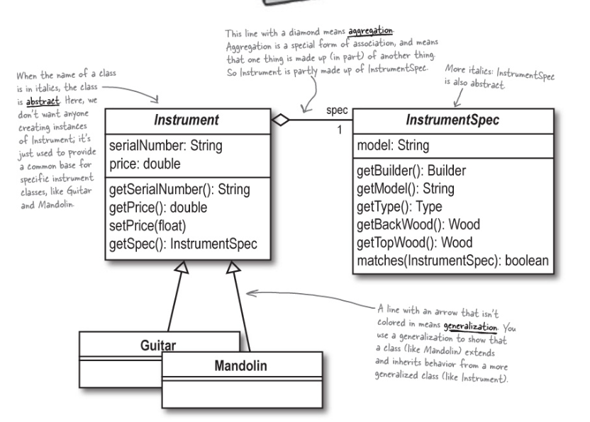

# 3.1 Rick's Stringed Instruments

## Introduction

Rick's guitar shop now also wants to sell different types of musical instruments (Mandolin for example).



## Steps to be taken:

1. Abstract out the Instruments since now there can be multiple instruments (Guitar and Mandolin).
2. Abstract out the InstrumentsSpecs since now there can be multiple specifications (each for Guitar and Mandolin).
3. Few properties (like build, type and model) are shared across both instruments so the `match` can be made a part of the `InstrumentSpec`.
4. `match` can then be overridden by the classes that implement it according to their specifications.

```kotlin
abstract class Instrument(
  private val serialNumber: String,
  private val price: Double,
  private val instrumentSpec: InstrumentSpec
) {
  fun getSerialNumber() = serialNumber
  fun getPrice() = price
  fun getSpec() = instrumentSpec
}
```

```kotlin
abstract class InstrumentSpec(
  private val build: Build,
  private val type: Type,
  private val model: Model
) {
  fun getType(): Type = type
  fun getModel(): Model = model
  fun getBuild(): Build = build

  open fun match(otherSpec: InstrumentSpec): Boolean {
    return (otherSpec.build != this.build || otherSpec.type != this.type || otherSpec.model != this.model)
  }
}
```

## Why did this helped? - Encapsulation

1. Just need to create `Guitar` and `Mandolin` classes implement `Instrument`. Similarly, for their specs. This greatly helped reduce code duplication.
2. Any future instruments need to only implement these 2 abstract classes and do minimal changes to the code.
